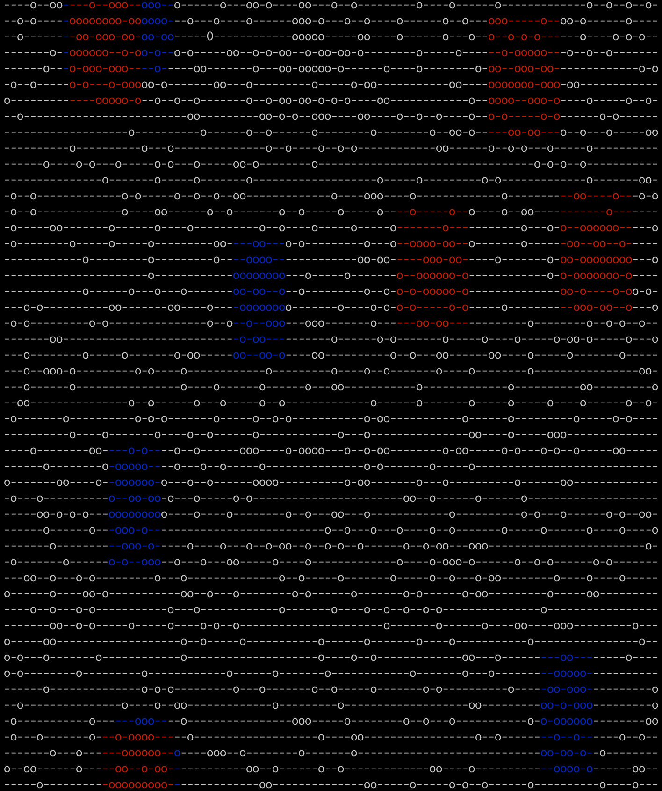

# Radar Analyzer

## Setup
Install `ruby-2.6.5` and then install gems:
```
bundle install
```

## Run
Pass a file with radar signal example as argument:
```
ruby main.rb radar_example.txt
```

## Tests
All spec files are in spec folder. To run all test use `rspec` command.

## Results output

